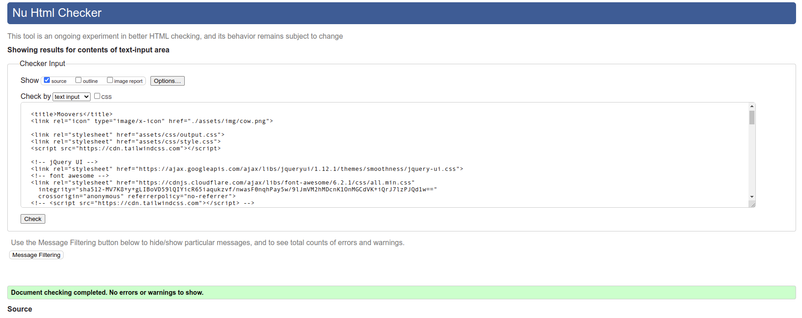
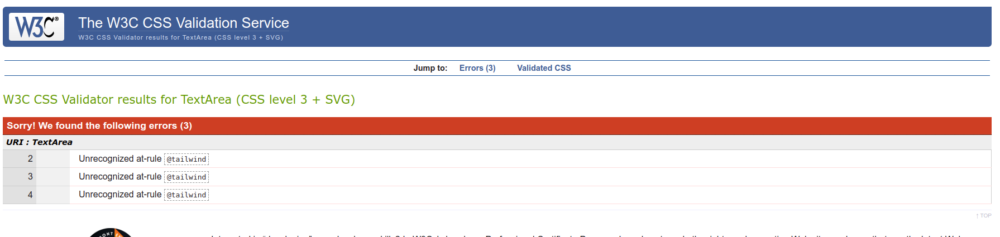
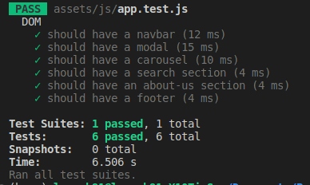

## Testing

### Validator Testing

- HTML
	- [index.html](index.html)
        - [W3C Markup Validation Service](https://validator.w3.org/) was used to validate the HTML code.
        - No errors were found.
        - 

- CSS
	- [style.css](assets/css/style.css)
        - [W3C CSS Validation Service](https://jigsaw.w3.org/css-validator/) was used to validate the CSS code.
        - No errors were found. 3 warnings were shown regarding the use of tailwind css at-rules, but these do not affect the functionality of the code.
        - 

- JavaScript
    - [script.js](assets/js/script.js)
        - [JSHint](https://jshint.com/) was used to validate the JavaScript code.
        - No errors were found.
        - One minor warning was found, but this does not affect the functionality of the code.
        - .png)
    - [api.js](assets/js/api.js)
        - [JSHint](https://jshint.com/) was used to validate the JavaScript code.
        - No errors were found.
        - .png)

### Manual Testing

- Navigation Bar
    - All links work as expected.
    - Navigation bar is responsive.
    - Navigation bar is fixed to the top of the page.

- Hero Section
    - Section is responsive.
    - Hero image is responsive.
    - Call-to-action button is responsive.
    - Call-to-action button works as expected.

- Search Section
    - Section is responsive.
    - Form is minimized until the user clicks into the search bar.
    - Form is responsive.
    - Typing into the search bar displays a dropdown menu with airport suggestions.
    - The search button is disabled until the user has selected an airport.
    - The search button works as expected.
    - Flight results are displayed as expected.
    - The info button works as expected.
    - User is notified if no results are found.

- Review Section
    - Section is responsive.
    - Review cards are responsive.
    - Review cards are displayed as expected.

- About Section
    - Section is responsive.
    - About cards are responsive.
    - About cards are displayed as expected.

- Footer
    - Footer is responsive.
    - Footer is fixed to the bottom of the page.
    - All links work as expected.

### Unit Testing
- Code partially tested using [Jest](https://jestjs.io/).
- 

### Bugs

#### Known Bugs
- Amadeus API sometimes returns a 429 (too many requests) error when the user searches for an airport. This is due to the API's rate limit. This does not affect the functionality of the site, if the user continues to search for an airport, the API will eventually return a result.

#### Fixed Bugs
- The empty results from API were not being handled correctly and a user would not see an indication of it. This has been fixed by adding a conditional statement to check if the results are empty.

- The form minimized itself if a user clicked outside of the search input, even if clicked on the search button. This has been fixed by adding a conditional statement to check if the user clicked on the search button or other elements of the form.
